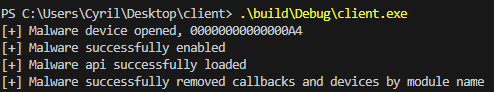

# ABYSSWORKER Client
This project implements an example client for the ABYSSWORKER driver. 

## Requirements
- Windows host x64 (tested on windows 10 22H2)
- The reference sample is available [here](https://www.virustotal.com/gui/file/6a2a0f9c56ee9bf7b62e1d4e1929d13046cd78a93d8c607fe4728cc5b1e8d050)

## Install and run Driver
```text
sc create MALWARE binPath="<your-path>\smuol.sys" type=kernel
sc start MALWARE
```

## Build
```text
.\build\Debug\client.exe
cmake -B build -S .
cmake --build build
```

## Usage
```text
.\build\Debug\client.exe
```
