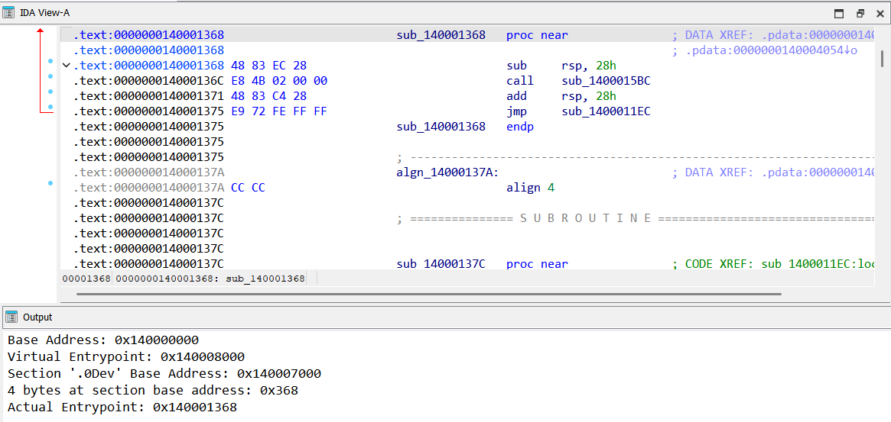
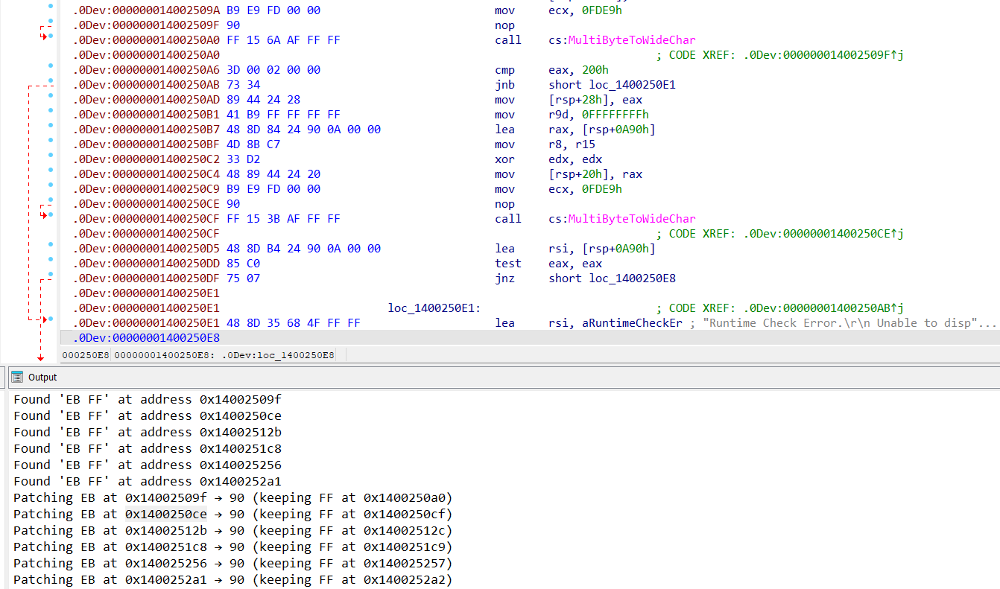
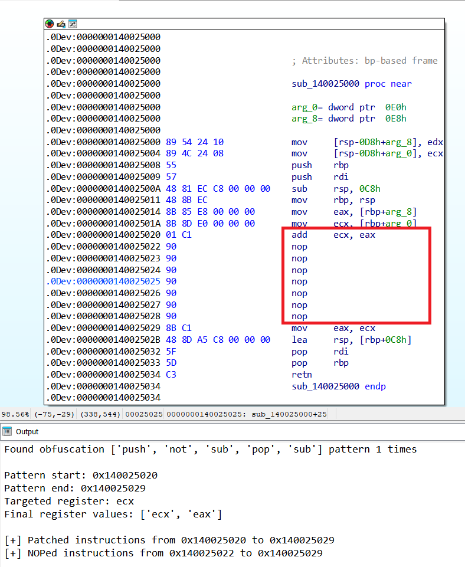
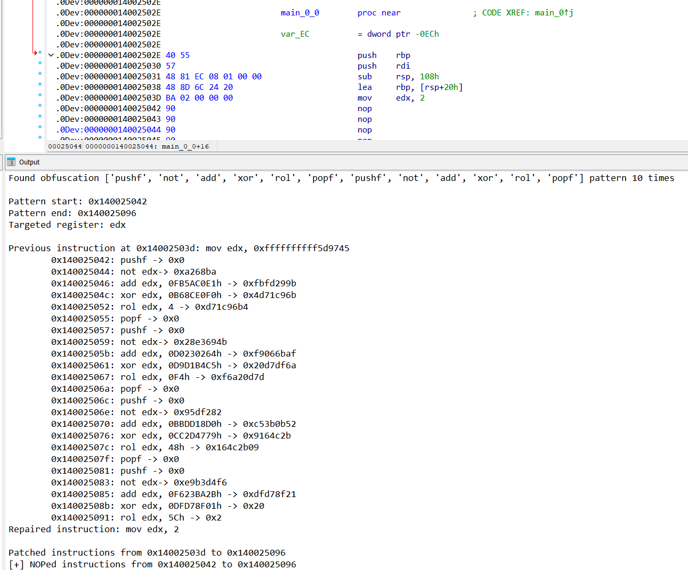
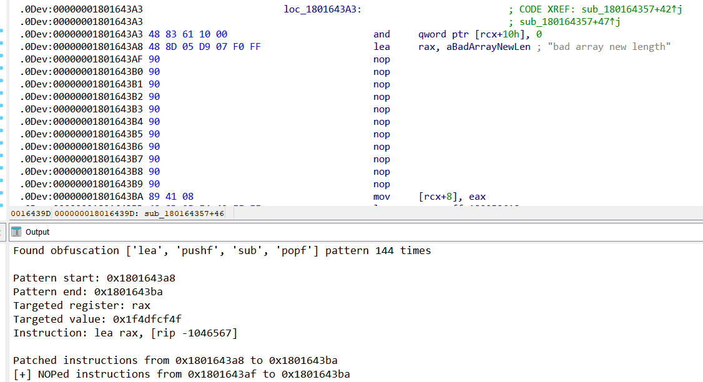

## Alcatraz de-obfuscation tooling by Elastic Security Labs

Elastic Security Labs has observed open-source obfuscator, [Alcatraz](https://github.com/weak1337/Alcatraz) used within malware and targeted campaigns. These IDA Python scripts can be used to clean Alcatraz-protected binaries using the default obfuscation passes. Samples files are included in the `bin` directory for testing and research purposes. 

Alcatraz research is published here:

- https://www.elastic.co/security-labs/deobfuscating-alcatraz

## Description

| Path               | Description                             |
| ------------------ | --------------------------------------- |
| [`0.find_custom_entrypoint.py`](0.find_custom_entrypoint.py)            | IDA Python script that identifies custom entrypoint |
| [`1.remove_anti_disassembly.py`](1.remove_anti_disassembly.py)          | IDA Python script that removes anti-disassembly |
| [`2.deobfuscate_alcatraz.py`](2.deobfuscate_alcatraz.py)             | IDA Python script used to de-obfuscate multiple Alcatraz techniques |
| [`utils/common.py`](utils/common.py)                                    | Module to hold shares functions used in de-obfuscation scripts |
| [`utils/patterns.py`](utils/patterns.py)                                | Alcatraz signature patterns |
| [`requirements.txt`](requirements.txt)                                  | List of required Python packages |
| [`bin`](bin/)                                                           | Alcatraz-protected test examples of non-malicious code  |


## Requirements

### Python

- Python3 `>=3.10`
- lief
- keystone-engine

## Install

```text
$$> virtualenv venv
$$> ./venv/script/activate
(venv) $$> pip3 install -r requirements.txt
```

### Getting Started

This tooling can be used to support the de-obfuscation process with any Alcatraz-protected program. The signature patterns are based on the default obfuscation passes within Alcatraz. In order to clean a file, the following steps are recommended. 

1. Remove the anti-disassembly, set function boundaries 
2. Run de-obfuscation across all functions or individual functions


### Usage

1. Open up IDA Pro with any Alcatraz-protected program (Test samples inside `bin`)
2. Within IDA Pro, click the File Menu then click `Script File` then choose the respective script. 
  - For finding entrypoint, select `0.find_custom_entrypoint.py`
  - For anti-disassembly (`0xEB 0xFF`), select `1.remove_anti_disassembly.py` 
  - For remaining obfuscation techniques, select `2.deobfuscate_alcatraz.py`

3. Monitor the command output, and review any modifications
4. If needed, apply control unflattening techniques using existing IDA Plugins such as [`D810`](https://github.com/joydo/d810)


## Screenshot Examples


### Finding custom entrypoint

<br>
<br>
    <div align="center">
      
</div>
<br>

### Fixing anti-disassembly

<br>
<br>
    <div align="center">
    
</div>
<br>

### Recovering mutation

<br>
<br>
    <div align="center">
    
</div>
<br>

### Constant unfolding (Immediate MOV obfuscation)

<br>
<br>
    <div align="center">
    
</div>
<br>

### LEA Obfuscation 

<br>
<br>
    <div align="center">
    
</div>
<br>
