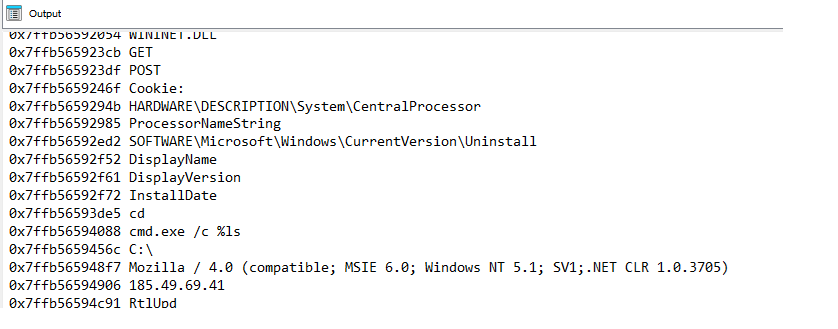
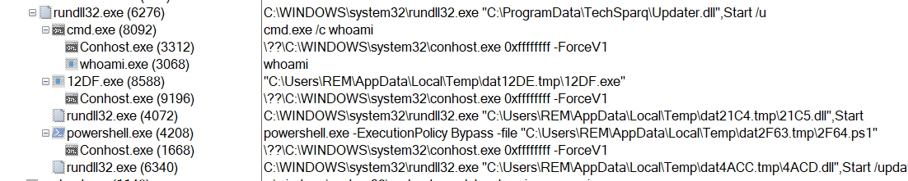

## WARMCOOKIE malware analysis tools by Elastic Security Labs

Elastic Security Labs has written IDAPython script used to decrypt strings from WARMCOOKIE. The decrypted strings will be placed in decompiler helping analyst identify key functionality. In addition, Elastic Security Labs has written a Python Flask script to handle and simulate command and control communication from WARMCOOKIE.

WARMCOOKIE research is published here:

- https://www.elastic.co/security-labs/dipping-into-danger

## Description

| Path               | Description                             |
| ------------------ | --------------------------------------- |
| [`warmcookie_str_decrypt.py`](warmcookie_str_decrypt.py)    | Annotates IDA Pro IDB with decrypted strings in decompiler |
| [`warmcookie_http.py`](warmcookie_http.py)                  | Simulate WARMCOOKIE command and control communication requests |

## Requirements

### Python

- Python3 `>=3.10`

## warmcookie_str_decrypt.py

Decrypts encrypted strings on WARMCOOKIE [samples](https://www.virustotal.com/gui/file/ccde1ded028948f5cd3277d2d4af6b22fa33f53abde84ea2aa01f1872fad1d13/) and inserts comment within IDA decompilation with decrypted string.

### Usage

1. Open up IDA Pro with WARMCOOKIE [sample](https://www.virustotal.com/gui/file/ccde1ded028948f5cd3277d2d4af6b22fa33f53abde84ea2aa01f1872fad1d13/).
2. Within IDA Pro, click the File menu then click `Script File`.
3. Within the file dialog prompt, choose the Python script from this repo (`warmcookie_str_decrypt.py`).
4. Navigate to IDA's console output to view decrypted strings and their address.

<br>
<br>
    <div align="center">
      
</div>
<br>
5. Navigate to different functions to view decrypted string as comments.

<br>
<br>
    <div align="center">
      
</div>
<br>

## warmcookie_http.py

This Python script simulates the C2 server for WARMCOOKIE [sample](https://www.virustotal.com/gui/file/f4d2c9470b322af29b9188a3a590cbe85bacb9cc8fcd7c2e94d82271ded3f659/) (August 2024). This script should NOT be used in a production environment. This is for testing and performing research that interacts directly with malware. Any activity related to this project should be conducted inside an isolated network. 

The objective of this script is to provide analysts the underlying behavior for every WARMCOOKE handler. Since we do not have the source for the C2 server, we can mock our own server, implement the checksum functionality and pass the required data back and forth for WARMCOOKIE to run correctly. This is a proof-of-concept script that will walk through each handler in sequential order, feel free to modify the script to your needs. WARMCOOKIE has several post-execution handlers, for these handlers you will be required to pass your own content such as DLL, a PowerShell Script or a Windows executable. WARMCOOKIE uses HTTP over port 80 for command and control communication, the Flask server will catch these requests and respond with the correct data.

## Getting Started

1. Download recent WARMCOOKIE [sample](https://www.virustotal.com/gui/file/f4d2c9470b322af29b9188a3a590cbe85bacb9cc8fcd7c2e94d82271ded3f659/).
2. Download [JavaScript](https://www.virustotal.com/gui/file/87f57a7a4b4c83ecb3cdd5f274c95cd452c703de604f68aff6e59964b662e3f8) if you want to execute from initial chain.
3. Setup VM environment in a closed environment based on your needs or requirements. Typically, there is one VM that acts as a proxy/server catching the malware requests, and a separate VM where the malware is executed on. 
4. Install Python libraries for Flask and PyCryptodome.

```
    pip install Flask
    pip install pycryptodome
```

4. Modify the following global variables on lines 13-21 of the Python script (`warmcookie_http.py`):

- `DLL_PATH` - A Windows DLL (.dll) that will be executed
- `DLL_EXPORT` - Export for Windows DLL that will be executed. For handler (8), WARMCOOKIE hardcodes the `Start` export. 
- `EXE_PATH` - A Windows executable (.exe) that will be executed 
- `PS1_PATH` - A PowerShell Script (.ps1) that will be executed 
- `COMMAND` - A command to be executed using `cmd /c`
- `FILE_PATH` - A file path where WARMCOOKIE will create a new file
- `FILE_DATA` - Data for the new file that was created
- `WARMCOOKIE_DLL` - If using the JavaScript initial execution, the WARMCOOKIE malware can be stored as this location for it to be downloaded

5. Based on the previous step, move all the respective files onto the proxy/server and verify all the files permissions are correct to allow the client to download these files.
6. Ensure the network connectivity is in-place, the two VM's should be able to communicate back and forth in a closed secure environment.
7. Start the Flask server by executing `python3 warmcookie_http.py`.
8. With the Flask server running, the WARMCOOKIE sample can now be detonated in a different virtual machine. There are several ways to do the execution:
- Execute DLL manually command-line (`rundll32 WARMCOOKIE.dll, Start`)
- Execute DLL manually with second-stage command-line (`rundll32 WARMCOOKIE.dll, Start /u`)
- Execute the chain from the [JavaScript](https://www.virustotal.com/gui/file/87f57a7a4b4c83ecb3cdd5f274c95cd452c703de604f68aff6e59964b662e3f8), this will use PowerShell to download WARMCOOKIE, execute WARMCOOKIE using the Start export. This execution will create a scheduled task, which will then run through the command-handlers. For this to work, the `WARMCOOKIE_DLL` must be downloaded and filled out with path on Flask server.
9. After execution observe/monitor the behaviors and build different detections for each handler. The last handler will delete the scheduled task and remove the WARMCOOKIE DLL.

<br>
<br>
    <div align="center">
      
    <figcaption> WARMCOOKIE process tree after execution</figcaption>
</div>
<br>


